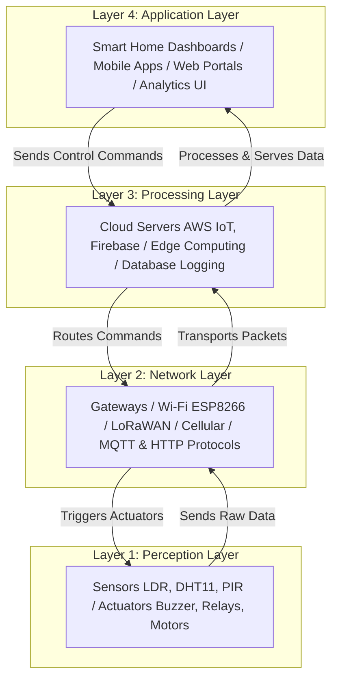

# Module 2 Theory Answers: IoT Fundamentals & Arduino Programming
*Course Coursework: Week 2, Assignments Q11, Q12, Q13, Q19 & Q20*

---

## Q11. 4-Layer IoT Architecture Diagram

Below is the structured architecture showing data flow from sensors to end-user applications:



### Examples for Each Layer:
1. **Perception Layer:** DHT11 Temperature Sensor (acquires environmental temperature data).
2. **Network Layer:** Wi-Fi (ESP8266 module using MQTT protocol to transmit readings).
3. **Processing Layer:** AWS IoT Core (analyzes inputs, runs rules, and triggers database insertions).
4. **Application Layer:** Mobile App dashboard showing a real-time graph of temperature history.

---

## Q12. Microcontroller (MCU) vs. Microprocessor (MPU)

| Parameter | Microcontroller (e.g., Arduino UNO) | Microprocessor (e.g., Raspberry Pi 4) |
| :--- | :--- | :--- |
| **CPU Speed** | 16 MHz (Slow, optimized for low latency IO) | 1.5 GHz+ (Fast, multi-core processing) |
| **On-chip RAM** | 2 KB SRAM (Very tiny) | 2 GB - 8 GB SDRAM (Large storage memory) |
| **On-chip Flash** | 32 KB (For storing bare-metal firmware) | None (Requires external microSD card/eMMC) |
| **Operating System** | None (Runs bare-metal C++ code or RTOS) | Runs Full OS (Linux, Raspberry Pi OS, Windows IoT) |
| **Typical Use Case** | Reading analog sensors, controlling relays, PWM motor driving | Image processing, hosting databases, gateway routing, AI edge tasks |
| **Power Consumption** | ~50-100 milliwatts (Extremely low, battery-friendly) | ~5-15 Watts (High, needs power adapter & cooling) |

---

## Q13. Arduino Pin Types & IoT Use Cases

1. **Digital Input:**
   * **Explanation:** Reads binary states (HIGH / 5V or LOW / 0V).
   * **IoT Use Case:** Connecting a **PIR Motion Sensor** or push button to detect intrusion or user triggering.
2. **Digital Output:**
   * **Explanation:** Sets a pin to HIGH (5V) or LOW (0V) to source/sink current.
   * **IoT Use Case:** Turning on a **Relay Module** to switch on an AC appliance (e.g., a fan).
3. **Analog Input:**
   * **Explanation:** Reads a range of continuous voltage (0V to 5V) using a 10-bit ADC, mapping it to a value between `0` and `1023`.
   * **IoT Use Case:** Reading a **Soil Moisture Sensor** to monitor agricultural watering needs.
4. **PWM Output (Pulse Width Modulation):**
   * **Explanation:** Simulates analog voltage output by rapidly switching a digital pin ON and OFF at varying duty cycles (0 to 255).
   * **IoT Use Case:** Fading a night light LED or controlling the speed of a ventilation fan.
5. **I2C / SPI Pins (SDA, SCL, MOSI, MISO, SCK):**
   * **Explanation:** Serial communication buses allowing the Arduino to communicate with multiple sensors over just 2 (I2C) or 4 (SPI) wires.
   * **IoT Use Case:** Interfacing with a high-accuracy **BMP280 Barometric Pressure Sensor** or a **16x2 LCD Display** with an I2C backpack.

---

## Q19. `analogRead()` vs. `analogWrite()` & PWM

* **`analogRead(pin)`**:
  * Reads the voltage on an Analog pin (A0-A5). The Arduino's ADC converts the 0-5V signal to a 10-bit integer (`0` to `1023`).
  * *IoT Example:* Reading an analog light-dependent resistor (LDR) to measure ambient sunlight.
* **`analogWrite(pin, value)`**:
  * Outputs a PWM (Pulse Width Modulation) signal on pins marked with a tilde `~` (3, 5, 6, 9, 10, 11). The value is 8-bit (`0` to `255`), representing the duty cycle.
  * *IoT Example:* Adjusting the brightness of an LED indicator on an IoT dashboard to reflect light levels.

### What is PWM (Pulse Width Modulation)?
PWM is a technique of simulating analog output with digital signals by turning the pin HIGH and LOW extremely rapidly. The average voltage is determined by the **Duty Cycle** (the ratio of time the signal is HIGH versus the total period). 

* **Why is it used?** It allows a microcontroller, which can only output binary signals (0V or 5V), to control analog devices (like motor speeds, heating elements, and LED brightness) efficiently without generating high thermal losses associated with analog linear voltage regulators.

---

## Q20. `setup()` vs. `loop()` & Non-Blocking Design

* **`setup()`**: Runs exactly once when the Arduino boots up or resets. Used for configuring pin modes, initializing serial communication, and booting libraries.
* **`loop()`**: Runs repeatedly and continuously as long as the Arduino is powered. It contains the primary controller logic.

### The Problem with `delay()` in `loop()`
If you put a long `delay(5000)` inside `loop()`, the CPU halts execution and does nothing for 5 seconds. 
* **Effect on Sensor Responsiveness:** The microcontroller cannot read inputs during the delay. If a user presses a button, or a critical sensor reading (like smoke detection or collision warning) occurs during this window, it will be completely ignored or delayed, creating an unresponsive and unsafe system.

### The Non-Blocking Alternative: `millis()`
Instead of halting the processor, we can use the `millis()` function. `millis()` returns the number of milliseconds elapsed since the Arduino board began running the current program. By recording the start time of an action and comparing it to the current `millis()` value on each loop cycle, we can trigger actions at specific intervals while letting the loop run at full speed.

**Example comparison:**
```cpp
// BLOCKING:
digitalWrite(13, HIGH);
delay(1000); // CPU is frozen here!
digitalWrite(13, LOW);

// NON-BLOCKING:
unsigned long currentMillis = millis();
if (currentMillis - previousMillis >= interval) {
  previousMillis = currentMillis;
  // Toggle LED state...
}
// CPU can check sensors and buttons here instantly!
```
